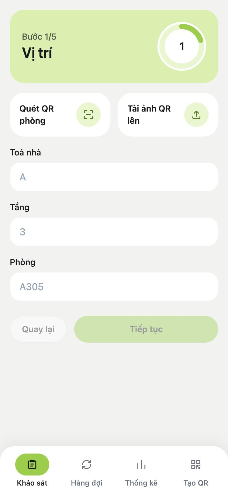
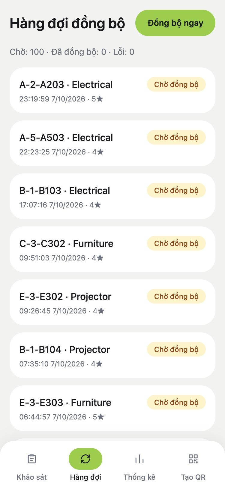
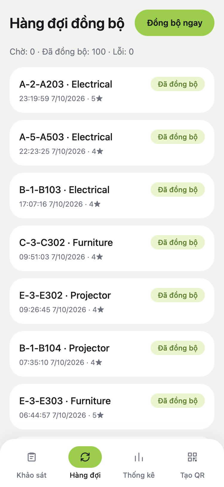
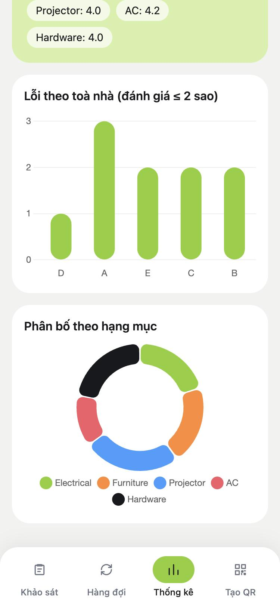

# MINI-PROJECT SHORT TECHNICAL REPORT
**Course:** Cross-Platform Mobile App Development (VKU)  
**Mini-Project Title:** Mini-Project 1 — VKU Field Survey: Offline Data Collection (PWA)  
**Team / Student Name:** Nguyen Van Khang  
**Submission Date:** 14/09/2026

---

## 1. GENERAL INFORMATION & DELIVERABLE LINKS
* **Team Members:**
    1. Nguyen Van Khang — Student ID: 23IT121 — Role: Sole developer (frontend, sync engine, API, Android packaging) — Contribution: 100%
* **🔗 Live Demo URL:** https://university-field-survey-pwa.vercel.app
* **💻 GitHub Repository:** https://github.com/khgngx/University-Field-Survey-PWA-Capacitor.git
* **🎥 Video Demo (Optional):** None — the app is demonstrated live.

---

## 2. FEATURE IMPLEMENTATION CHECKLIST

| # | Required Feature | Status | Implementation Details & Acceptance Level |
|:---:|---|:---:|---|
| 1 | Installable PWA with offline App Shell | ✅ Complete | Workbox `injectManifest` Service Worker precaches HTML/CSS/JS/icons (25 entries) and serves them Cache-First; web manifest with 192/512/maskable icons, `display: standalone`. Offline reload works on the production build (`npm run preview`), not on the dev server. |
| 2 | Multi-step survey form with validation | ✅ Complete | 5-step wizard (Location → Category → Rating → Photo → Review). "Next" is disabled until the step's required fields are valid; the same rules (`validateForSubmit`) run again on submit and on the server. |
| 3 | Local offline persistence | ✅ Complete | IndexedDB via Dexie is the source of truth. Drafts autosave after a 500 ms pause and on tab hide/unload, so a refresh never loses input. Submitted surveys get a UUID and enter the queue as `PENDING_SYNC`. |
| 4 | Sync queue with automatic retry | ✅ Complete | Surveys are sent one at a time, oldest first. Retryable failures (network, 5xx, 408, 429) back off `min(2^n × 5 s, 5 min)` for up to 5 attempts; other 4xx fail immediately with the server message. Queue page shows every status and offers "Retry" / "Retry all". |
| 5 | Automatic sync on reconnection | ✅ Complete | Triggers: Capacitor `Network` listener, `window.online`, a 30 s poll, app start, and manual "Sync now". An offline banner is shown while disconnected. |
| 6 | Background Sync when the app is closed | ⚠️ Partial | Service Worker `sync` event flushes the queue, but the Background Sync API only exists in Chromium browsers — not Safari and not the Android WebView. The main-thread triggers in row 5 cover those platforms. |
| 7 | Native device features (Capacitor) | ✅ Complete | Camera (photo, compressed before storage), Geolocation (GPS stamp on submit), Barcode Scanner (room QR), Local Notifications ("synced N surveys"), Network status. All Capacitor calls are isolated in `src/services/`. |
| 8 | Room QR codes | ✅ Complete | QR payload `building\|floor\|room`. Scan with the camera, upload a saved QR image (decoded offline with jsQR), or generate and download/share a labelled PNG. Known limit: the PNG download link may not save inside the Android WebView. |
| 9 | Duplicate detection & versioning | ✅ Complete | A room surveyed in the last 24 h is detected offline through a compound IndexedDB index; the user chooses to create version *n + 1* or cancel. |
| 10 | Offline statistics dashboard | ✅ Complete | Chart.js, computed from local data only: status counters, average rating overall and per category, defects per building (rating ≤ 2), distribution by category. |
| 11 | Backend API & cloud storage | ✅ Complete | Vercel Serverless `POST /api/surveys` → Supabase (Postgres table + private photo bucket). Idempotent upsert by UUID; input validated and size-limited; CORS allow-list. No user authentication (not required by the brief). |
| 12 | Android packaging | ✅ Complete | Capacitor 8 Android project; `npm run build:apk` produces a debug APK (web build → `cap sync` → Gradle). The APK was installed and run on an Android device. |
| 13 | Responsive mobile UI | ✅ Complete | Mobile-first Tailwind CSS layout, bottom tab bar, safe-area insets. Light theme only (no dark mode). |
| 14 | Automated tests & CI | ✅ Complete | 120 unit tests (Vitest + fake-indexeddb) covering the repository, sync engine, backoff, QR parsing, statistics and the API handler. GitHub Actions runs lint, tests and build on every push to `main`. |

---

## 3. TECHNICAL ARCHITECTURE & PROJECT STRUCTURE

**Stack:** React 19 + Vite · Tailwind CSS 4 · Dexie (IndexedDB) · Workbox · Capacitor 8 · Chart.js · Vercel Serverless + Supabase.

**Directory structure**

```
src/
  db/          Dexie schema + survey repository (draft, submit, duplicate lookup)
  sync/        Sync engine — no DOM/Capacitor imports, so the Service Worker reuses it
  services/    The only code that calls Capacitor (camera, geo, network, scanner, notifications)
  hooks/       useDraft (autosave), useSyncQueue (live query), useNetworkStatus
  pages/       SurveyWizard (5 steps), QueuePage, Dashboard, QrGenerator
  components/  Presentational pieces (StarRating, StatusBadge, ChartCanvas, …)
  utils/       Pure functions: backoff, stats, QR format, image compression, shared limits
  sw.js        Service Worker: precache + Background Sync
api/           Vercel function; logic in api/_lib (validation, multipart parsing, handler)
supabase/      schema.sql (table, RLS, private bucket)
android/       Capacitor Android project
```

**State management and data flow**

There is no global state library. IndexedDB is the single source of truth and the UI subscribes to it:

```
Wizard input ──► useDraft (React state + 500 ms debounced save) ──► IndexedDB [DRAFT]
Submit ────────► validate ► status = PENDING_SYNC
Sync engine ───► PENDING_SYNC ► SYNCING ► SYNCED
                                      └──► FAILED (nextRetryAt = backoff) ──► retried when due
Queue / Dashboard ◄── Dexie liveQuery (re-renders automatically on every change)
```

The server is only a sync target: the app never reads from it, so every screen works with no network.
Validation limits (`utils/limits.js`, `utils/categories.js`) are imported by both the client and the API, so the two cannot disagree about what is accepted.

**Exception handling strategy**

* **Input** is validated at the edges: in the wizard, again inside the submit transaction, and again on the server.
* **Sync errors are classified.** Network errors, timeouts (30 s), 5xx, 408 and 429 are retried with exponential backoff. Any other 4xx means the payload itself was rejected, so the survey is marked `FAILED` at once with the server's message instead of retrying forever.
* **A network-level failure ends the sync run** (the rest would fail the same way); an HTTP error does not block the surveys behind it.
* **Crash recovery:** a record left in `SYNCING` at startup means the app died mid-request, so it is re-queued.
* **Non-critical steps never block saving:** GPS, notification permission and the post-submit sync are best-effort; the survey is already safe in IndexedDB.
* **Every attempt is recorded** in a `syncLog` table, and errors are shown to the user next to the affected survey.

---

## 4. EMPIRICAL EVIDENCE & SCREENSHOTS

Captured from the web build running locally in a 375 × 812 mobile viewport (browser, not an emulator or physical device), with 100 sample surveys entered through the app's own draft → submit path and synced to the local API.

| 1. Survey wizard — step 1 | 2. Queue — waiting to sync |
|:---:|:---:|
|  |  |
| Step header with progress ring (1/5). Room details can be filled by scanning a room QR, uploading a QR image, or typing. "Tiếp tục" stays disabled until all three fields are valid. | 100 submitted surveys stored in IndexedDB with status "Chờ đồng bộ" (`PENDING_SYNC`). The counter line shows pending / synced / failed totals. |

| 3. Queue — after sync | 4. Offline dashboard |
|:---:|:---:|
|  |  |
| The same surveys after the sync engine sent them one by one: all 100 are "Đã đồng bộ" (`SYNCED`), 0 failed. | Statistics computed from local data only: defects per building (rating ≤ 2 stars) and distribution by category. Over the 100 surveys the average rating shown on this page is 4.2. |

---

## 5. TECHNICAL CHALLENGES & RESOLUTIONS

**Challenge 1 — Duplicate and endlessly repeating uploads.**
The sync queue can be started from several places at once: the main thread (network listener, 30 s poll, manual button) and the Service Worker's Background Sync event. Two runs could send the same survey twice, and a survey whose payload the server rejects would be retried forever if failures simply returned to the pending state.
*Resolution:* three layers. (1) A Web Lock (`navigator.locks`) makes the main thread and the Service Worker mutually exclusive, with a per-context flag as fallback on old WebViews. (2) The server upserts both the row and the photo by the survey's UUID, so a repeated send is harmless. (3) Failures are classified: permanent 4xx errors and surveys that used all 5 retries stay `FAILED` with no next-retry time and wait for the user's "Retry", instead of going back to `PENDING_SYNC` where the queue would pick them up again in a loop.

**Challenge 2 — The Service Worker crashed in development and the Android build failed on the installed JDK.**
(a) The Vite dev server injects an empty precache manifest; binding the navigation fallback to an `index.html` that is not precached threw an error and killed the whole worker, which also disabled Background Sync during development. *Resolution:* the fallback route is registered only when `index.html` is really in the manifest.
(b) Android Gradle Plugin 8.13 / Gradle 8.14 reject JDK 25, which was the system default. *Resolution:* `scripts/build-apk.sh` locates JDK 21 explicitly (JAVA_HOME, Homebrew, or `java_home -v 21`), checks the Android SDK, and stops with a clear message if either is missing.
